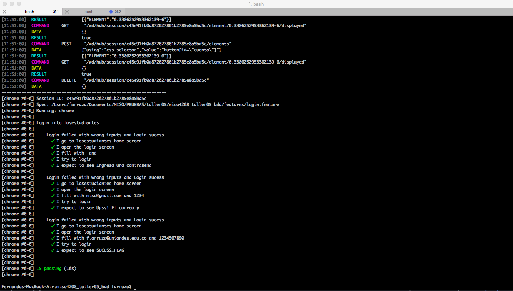

# TALLER 5: BDD utilizando Cucumber y Calabash.

## Cucumber
### Login exitoso

### Registro de usuario
##### Escenarios:
* Campo Nombre: vacío y es obligatorio.
* Campo Apellidos: vacío y es obligatorio.
* Campo Correo Electrónico: vacío y es obligatorio.
* Campo Correo Electrónico: valor incorrecto.
* Campo Password: vacío y es obligatorio.
* Campo Password: valor con longitud inferior a 8 caracteres.
* Campo Acepta Condiciones: no marcado.
* Registo fallido: usuario ya existente.
* Registro exitoso.

